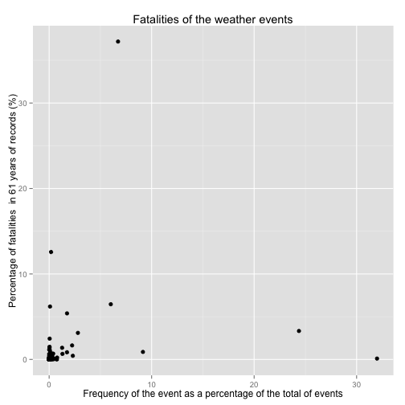
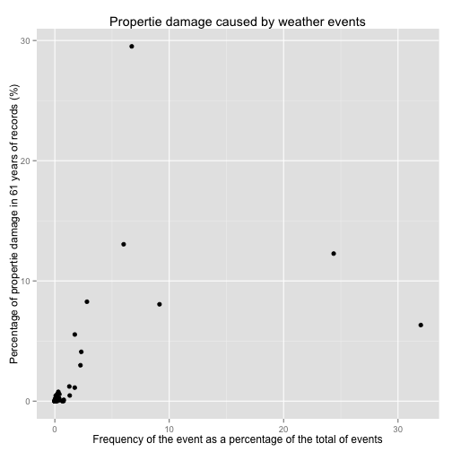

EVALUATION OF POTENTIAL IMPACT OF WEATHER EVENTS BASED ON RETROSPECTIVE ANALYSIS OF NOAA STORM DATABASE
===============================================
Synopsis
---------
With the objective of assess those weather events which can represent severe public health and economic problems, we have explored the U.S. National Oceanic and Atmospheric Administration's (NOAA) storm database. This database tracks characteristics of major storms and weather events in the United States, including when and where they occur, as well as estimates of any fatalities and injuries. 

We have taken the percentage of fatalities and property damage as an indicator of the severity and economic losses, respectively. We have inspected their relation with the frequency of the weather events to determine which ones can represent a problem. We have found that tornadoes, flood, hail and thunderstorm wind could represent the most severe problems relative to economic and human damages. The lightnings seems also to be of economic concern but not a population health problem.

The results and conclusions as well as the weaknesses of the study are summarized at the results section in order to provide material for a critical analysis of the issue.

Data Processing
---------------
We load the raw data

```r
# Load raw data
stormData <- read.csv("/Users/gaspar/Dropbox/Cursos/Coursera/ReproducibleResearch/Assessment2/RepData_PeerAssessment2/repdata-data-StormData.csv.bz2", 
    header = TRUE, fill = TRUE, na.strings = "NA")
# Explore the 37 variables
head(stormData, n = 0L)
```

```
##  [1] STATE__    BGN_DATE   BGN_TIME   TIME_ZONE  COUNTY     COUNTYNAME
##  [7] STATE      EVTYPE     BGN_RANGE  BGN_AZI    BGN_LOCATI END_DATE  
## [13] END_TIME   COUNTY_END COUNTYENDN END_RANGE  END_AZI    END_LOCATI
## [19] LENGTH     WIDTH      F          MAG        FATALITIES INJURIES  
## [25] PROPDMG    PROPDMGEXP CROPDMG    CROPDMGEXP WFO        STATEOFFIC
## [31] ZONENAMES  LATITUDE   LONGITUDE  LATITUDE_E LONGITUDE_ REMARKS   
## [37] REFNUM    
## <0 rows> (or 0-length row.names)
```

We're interested in the severity of the events so we're going to filter the raw data and make a smaller dataset that contains only:  
  * the weather events (EVTYPE) and their frequencies
  * the number and percentage of fatalities (FATALITIES)
  * the number and percentage of property damges (PROPDMG)

```r
# Extract the data we're interested and put them at temporary files
temp <- aggregate(stormData$FATALITIES, list(stormData$EVTYPE), FUN = sum)
temp$percent <- 100 * (temp$x/sum(temp$x))  # Add a column with the percentage
temp2 <- aggregate(stormData$PROPDMG, list(stormData$EVTYPE), FUN = sum)
temp2$percent <- 100 * (temp2$x/sum(temp2$x))
temp3 <- as.data.frame(table(stormData$EVTYPE))
# Tidy a little bit by giving proper names to the variables
names(temp)[2] <- "nfatalities"
names(temp)[3] <- "pfatalities"
names(temp2)[2] <- "nproperties"
names(temp2)[3] <- "pproperties"
# Merged the data to construct a dataset that contains all the data we're
# interested in
prueba <- merge(temp, temp2, by = "Group.1")
noaa <- merge(prueba, temp3, by.x = "Group.1", by.y = "Var1")
noaa$percent <- noaa$Freq/sum(noaa$Freq) * 100
# The dataset noaa is the one we're going to use for the analysis.
```

### Which types of events are most harmful to population health?
We're going to consider that fatalities in the population are the most harmful health problem. 

To obtain a quick vision of those events that cause more fatalities we represent the percentage of fatalities versus the frequency of the event (calculate in the 61 years of data we have).

```r
library("ggplot2")
```

```
## Warning: package 'ggplot2' was built under R version 2.15.2
```

```r
ggplot(noaa, aes(x = percent, y = pfatalities)) + geom_point(shape = 19) + labs(x = "Frequency of the event as a percentage of the total of events", 
    y = "Percentage of fatalities  in 61 years of records (%)") + ggtitle("Fatalities of the weather events")
```

 

We can isolate the event that is responsible of more percentage of deaths, above 30%.

```r
subset(noaa, noaa$pfatalities > 30)
```

```
##     Group.1 nfatalities pfatalities nproperties pproperties  Freq percent
## 834 TORNADO        5633       37.19     3212258       29.51 60652   6.722
```

It corresponds to tornados. It is important to notice that the frequency of this event it's not negligible (7% of the total events in the 61 years were tornados).

Another group of events that must be of our concern corresponds to those ones that, been not so severe in the number of fatalities, are frequent (avove 5% of the total events in the 61 years).

```r
subset(noaa, noaa$percent > 5)
```

```
##               Group.1 nfatalities pfatalities nproperties pproperties
## 153       FLASH FLOOD         978     6.45758     1420125      13.047
## 244              HAIL          15     0.09904      688693       6.327
## 760 THUNDERSTORM WIND         133     0.87818      876844       8.056
## 834           TORNADO        5633    37.19379     3212258      29.512
## 856         TSTM WIND         504     3.32783     1335966      12.274
##       Freq percent
## 153  54277   6.015
## 244 288661  31.992
## 760  82563   9.150
## 834  60652   6.722
## 856 219940  24.376
```

We can see that thunderstorm wind, hail and floods can represent a serious problem due to their relative high frequency.

### which types of events have the greatest economic consequences?
We want to evaluate which events have the greatest economic consequences, we're going to consider the properties damages (PROPDMG) as an indicator of the economic expenses caused by the weather event.

As we did with the former case related with health, we represent the percentage of the properties damages versus the frequency of the event (calculate in the 61 years of data we have).

```r
library("ggplot2")
ggplot(noaa, aes(x = percent, y = pproperties)) + geom_point(shape = 19) + labs(x = "Frequency of the event as a percentage of the total of events", 
    y = "Percentage of propertie damage in 61 years of records (%)") + ggtitle("Propertie damage caused by weather events")
```

 

We are going to consider events of some concern those that caused more than 5% of the property damages or the ones that represented more than 5% of the ocurrence of total events in the 61 years of data recollection.

```r
subset(noaa, noaa$pproperties > 5)
```

```
##               Group.1 nfatalities pfatalities nproperties pproperties
## 153       FLASH FLOOD         978     6.45758     1420125      13.047
## 170             FLOOD         470     3.10333      899938       8.268
## 244              HAIL          15     0.09904      688693       6.327
## 464         LIGHTNING         816     5.38792      603352       5.543
## 760 THUNDERSTORM WIND         133     0.87818      876844       8.056
## 834           TORNADO        5633    37.19379     3212258      29.512
## 856         TSTM WIND         504     3.32783     1335966      12.274
##       Freq percent
## 153  54277   6.015
## 170  25326   2.807
## 244 288661  31.992
## 464  15754   1.746
## 760  82563   9.150
## 834  60652   6.722
## 856 219940  24.376
```

```r
subset(noaa, noaa$percent > 5)
```

```
##               Group.1 nfatalities pfatalities nproperties pproperties
## 153       FLASH FLOOD         978     6.45758     1420125      13.047
## 244              HAIL          15     0.09904      688693       6.327
## 760 THUNDERSTORM WIND         133     0.87818      876844       8.056
## 834           TORNADO        5633    37.19379     3212258      29.512
## 856         TSTM WIND         504     3.32783     1335966      12.274
##       Freq percent
## 153  54277   6.015
## 244 288661  31.992
## 760  82563   9.150
## 834  60652   6.722
## 856 219940  24.376
```

As in the case of population health problems we can see than flood, hail and thunderstorm wind as well as tornadoes can represent an important problem.  There is however a new weather event that doesn't appear at the former analysis but can suppose serious economic problems: lightnings. It make sense as lightnings can affect electrical infrastructures but fatalities related with them are very unusual events.

Results
-------
We have found that flood, hail and thunderstorm wind, can potentially represent the weather events with more damage in human lives as well as economic losses. A special mention deserves the tornadoes which can be really disastrous and the cause of great devastation, and that, furthermore are events relatively frequent. The lightnings can be of concern in relation with economic damages as, we suppose, they potentially can affect critical infrastructures.

It is important to notice here than we find a very important problem with the data: we have different names that refer to the same event. This is a critical problem of consistency of the database but we have decided to deal with this problem by inspection of the data through the analysis. A more systematic approach would be required to obtain more accurate results.


